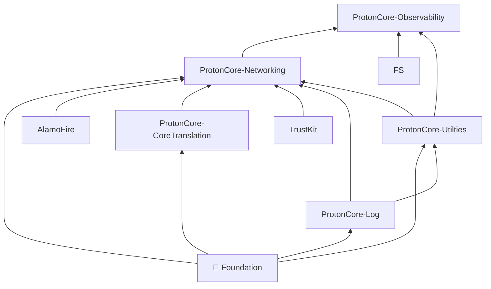

#  ProtonCore Observability

This framework adds in the capability to send reports to Prometheus.
Requests are sent through an unauthenticated session to the `/data/v1/metrics` endpoint.

## Dependency Graph



## How to add a new metric

**Step 1** - Create your event in `Sources/Events List` with the fields you want.

```swift
// file: EventNameTotalEvent.swift

public enum EventNameType: String, Encodable, CaseIterable {
    case type1
    case type2
}

public struct EventNameTotalLabels: Encodable, Equatable {
    // Specify any labels you need.
    // WARNING: Make sure to minimize the cartesian product of possible label values.
    // For example DO NOT use `Int`, because that would mean 4 billion possible values.
    let status: HTTPResponseCodeStatus
    let type: EventNameType

    enum CodingKeys: String, CodingKey {
        case status
        case type
    }
}

extension ObservabilityEvent where Payload == PayloadWithLabels<EventNameTotalLabels> {
    public static func eventNameResult(status: HTTPResponseCodeStatus, type: EventNameType) -> Self {
        .init(name: "ios_core_eventContext_eventName_total", labels: .init(status: status, type: type))
    }
}

```

**Step 2** - Clone [json-schema-registry](https://gitlab.protontech.ch/proton/be/json-schema-registry) repository and add the event json schema there

As the file name, use the event name with the version following the format: `ios_core_eventContext_eventName_total_v1.schema.json`

```json
{
    "$schema": "https://json-schema.org/draft/2020-12/schema",
    "type": "object",
    "properties": {
        "Labels": {
            "type": "object",
            "properties": {
                "status": { // <- Your field
                    "type": "string",
                    "enum": [ // <- Different cases of your field
                        "http200",
                        "http2xx",
                        "http4xx",
                        "http401",
                        "http5xx"
                    ]
                },
                "type": { // <- Your field
                    "type": "string",
                    "enum": ["type1", "type2"] // <- Different cases of your field
                }
            },
            "required": ["status", "type"],
            "additionalProperties": false
        },
        "Value": {
            "type": "integer",
            "minimum": 1
        }
    },
    "required": ["Labels", "Value"],
    "$id": "https://proton.me/ios_core_eventContext_eventName_total_v1.schema.json", // <- Your schema file
    "title": "me.proton.core.observability.domain.metrics.EventNameTotal", // <- Your schema title
    "description": "Event name result", // <- Your schema description
    "additionalProperties": false
}
```

**Step 3** - Merge JSON files

Create a new merge request for the new JSON schema files to [json-schema-registry](https://gitlab.protontech.ch/proton/be/json-schema-registry) repository.

> WARNING: Once the JSON schemas are merged into json-schema-registry, they still need to be
merged into Slim-API repository. Make sure to ask BE devs to do that.

## How to send data from your app

With the event already set up, it's really easy to send data from the app.

**Step 1** - Import observability module into your file

You'll need to call
```swift
import ProtonCoreObservability
```

and remember to add the `ProtonCoreObservability` module as a dependency of your module or app.

**Step 2** - Call the event you created when needed

```swift
ObservabilityEnv.report(.eventNameResult(status: .http200, type: .type1))
```

## Add your metric to Grafana

To create a new Grafana Dashboard, you can follow the document at https://confluence.protontech.ch/display/CP/Grafana+documentation

**Create your panel**

It depends on what you want to visualize on your panel, but usually you'll want to sum your events of the same type, so you can add a variation of the following query pattern:

`$interval` is an environment variable of type interval

```
// Success Status
sum by(status) (increase(ios_core_eventContext_eventName_total{status=~"http200|http2xx"}[$interval]))
or

// Failed Status
sum by(status) (increase(ios_core_eventContext_eventName_total{status!="http200", status!="http2xx"}[$interval]))
```

> **Remember**:  do not include the version on your event.
