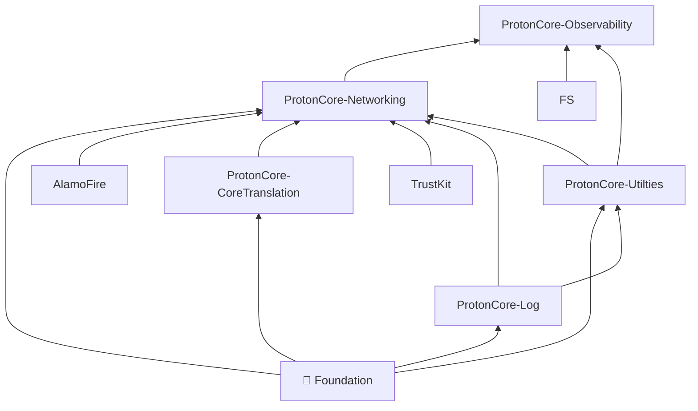

#  ProtonCore Observability

This framework adds in the capability to send reports to Prometheus.
Requests are sent through an unauthenticated session to the `/data/v1/metrics` endpoint.

## Dependency Graph

